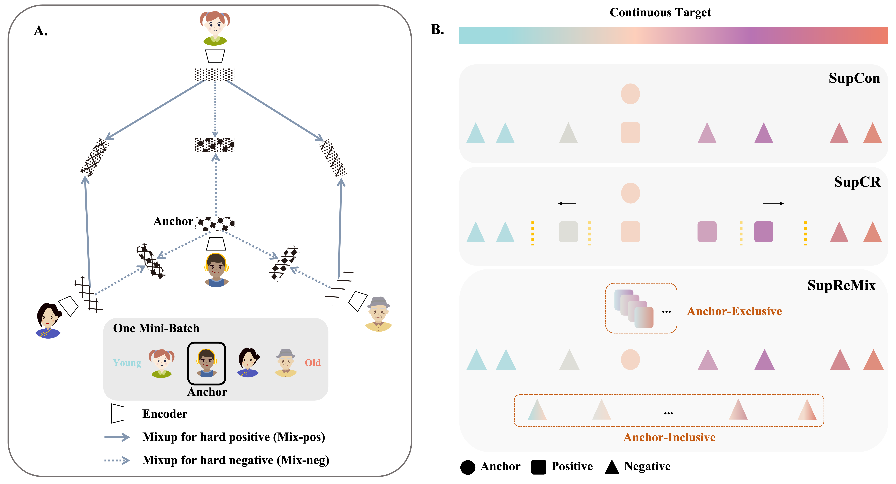
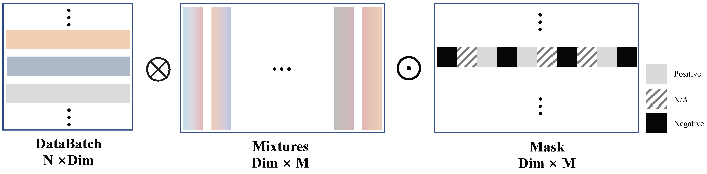

# Mixup Your Own Pairs

This repository contains the implementation code for paper: <br>
__Mixup Your Own Pairs__ <br>


## Overview
<div align="center">
  
</div>

## Usage
We separate the codebase for different datasets into different subfolders. Please go into the subfolders for more information (e.g., installation, dataset preparation, training, evaluation & models).

#### __IMDB-WIKI__ &nbsp;|&nbsp; __AgeDB-DIR__ &nbsp;|&nbsp; __STS-B-DIR__ &nbsp;|&nbsp; __UCI-airfoil__ &nbsp;|&nbsp; UK Biobank  &nbsp;|&nbsp; HCP-lifespan

## Code Preview
We provide examples of how SupReMix can be applied to your own datasets. There are three components in SupReMix: (1) Mix-neg, (2) Mix-pos, and (3) Distance Magnifying. We provide the code for each component in the following sections.


### Mix-neg & Mix-pos

```python
from torch.distributions.beta import Beta

def mixing_func(target, feature, mix_neg, mix_pos, n, b):
    """
    :param target: target labels shape: (batch_size, 1)
    :param feature: feature embeddings: (batch_size, dim)
    :param mix_neg: whether to mixup negatives: bool
    :param mix_pos: whether to mixup positives: bool
    :param n: the maximum distance between two positive samples: int
    :param b: the beta distribution parameter: int [0, 1, 2]
    :return: mixtures, myop_mask, myop_label
    """

    target = target.repeat(2, 1).squeeze(1).cpu()
    # mixing-construct mixture tensor
    mixtures = torch.zeros((target.shape[0], target.shape[0], target.shape[0], args.dim)) 
    myop_label = torch.zeros((target.shape[0], target.shape[0], target.shape[0]))
    myop_mask = torch.zeros((target.shape[0], target.shape[0], target.shape[0])) - 1

    # mixing-condition for negative pairs
    i = torch.arange(target.shape[0]).reshape(-1, 1, 1)
    j = torch.arange(target.shape[0]).reshape(1, -1, 1)
    k = torch.arange(target.shape[0]).reshape(1, 1, -1)

    t_i = target.reshape(-1, 1, 1)
    t_j = target.reshape(1, -1, 1)
    t_k = target.reshape(1, 1, -1)

    neg_condition1 = torch.eq(i, j) & ~torch.eq(i, k)
    neg_condition2 = ~torch.eq(t_j, t_k)
    neg_condition = neg_condition1 & neg_condition2
    myop_mask[neg_condition] = 0

    pos_condition = ((torch.lt(t_i, t_k) & (torch.abs(t_i - t_k) < n).int()) & (torch.lt(t_j, t_i) & (torch.abs(t_j - t_i) < n).int())).bool()
    myop_mask[pos_condition] = 1

    # --mixup--negatives--#
    if mix_neg:
        indices = torch.nonzero((myop_mask == 0)).cpu().t() 
        if b == 0:
            beta = Beta(2, 8)
        elif b ==1:
            beta = Beta(8, 2)
        else:
            beta = Beta(5, 5)
        alpha = beta.sample((indices.shape[1],)).reshape(-1, 1)
        # print(alpha.shape, feature.shape, indices.shape)
        new_mixtures = alpha * feature.clone().cpu()[indices[1]] + (1 - alpha) * feature.clone().cpu()[indices[2]]
        new_labels = alpha.squeeze(1) * target.clone().cpu()[indices[1]] + (1-alpha.squeeze(1)) * target.clone().cpu()[indices[2]]

        mixtures[indices[0], indices[1], indices[2]] = new_mixtures
        myop_label[indices[0], indices[1], indices[2]] = new_labels.detach()
    # --mixup--negatives--#

    # --mixup--positives--#
    if mix_pos:
        indices = torch.nonzero((myop_mask == 1)).cpu()
        chunk_size = 1000
        num_indices = indices.shape[0]
        for start_idx in range(0, num_indices, chunk_size):
            end_idx = min(start_idx + chunk_size, num_indices)
            chunk_indices = indices[start_idx:end_idx]
            i, j, k = chunk_indices.T

            # Calculate alpha for all i, j, k combinations in the current chunk using the vectorized function
            alpha = calculate_alpha_vectorized(i, j, k, target).cpu().view(-1, 1)
            # Update mixtures using calculated alpha for the current chunk
            mixtures[i, j, k] = (alpha * feature.clone().cpu()[j]) + ((1 - alpha) * feature.clone().cpu()[k])
            myop_label[i, j, k] = target[i]
    # --mixup--positives--#

    mixtures_rearranged = rearrange(mixtures, 'b n m d -> b (n m) d')
    myop_mask_rearranged = rearrange(myop_mask, 'b n m -> b (n m)')
    myop_label_rearranged = rearrange(myop_label, 'b n m -> b (n m)')

    # myop_mask_rearranged, mixtures_rearranged, myop_label_rearranged = '
    # compress_mixtures(myop_mask_rearranged, mixtures_rearranged, myop_label_rearranged) # compress matrix
    mixtures_rearranged = mixtures_rearranged.detach()
    myop_mask_rearranged = myop_mask_rearranged.detach()
    myop_label_rearranged = myop_label_rearranged.detach()

    return mixtures_rearranged, myop_mask_rearranged, myop_label_rearranged
```

<div align="center">
  
</div>


### Distance Magnifying 
```python
import torch

def calculate_weight(anchors, labels, distance='L1'):
    '''calcuate the weight that control the push strength for negative pairs based on label distance

    :param anchors: 1D tensor [N, ]
    :param labels : 1D tensor [N, ]
    :return weights: 2D tensor [N, N], 
    '''
    elif distance == 'L1':
        weights = torch.abs(anchors.view(-1, 1) - labels.view(1, -1)) + 1  # [1, 1e2]
    # elif distance == 'L2':
        weights = torch.pow((anchors.view(-1, 1) - labels.view(1, -1)), 2) + 1 # [1, 1e4]
    
    return weights
```

## Example for AgeDB-DIR

#### Prerequisites

1. Download AgeDB dataset from [here](https://ibug.doc.ic.ac.uk/resources/agedb/) and extract the zip file (you may need to contact the authors of AgeDB dataset for the zip password) to folder `./agedb-dir/data` 

2. We use the standard train/val/test split file (`agedb.csv` in folder `./agedb-dir/data`) provided by Yang et al.(ICML 2021), which is used to set up balanced val/test set. To reproduce the results in the paper, please directly use this file. You can also generate it using

```bash
cd agedb-dir
python data/create_agedb.py
python data/preprocess_agedb.py
```

#### Dependencies

```bash
pip install torch==1.6.0 tensorboard_logger numpy pandas scipy tqdm matplotlib Pillow wget einops
```


### 1. Train baselines

To pretrain the model with SupReMix loss
```bash
python train_supremix.py --contrastive_method supremix --store_root </checkpoint_root> --data_dir </data_folder> 
```
To resume AgeDB training
```bash
python train_supremix.py --contrastive_method supremix --store_root </checkpoint_folder>  --data_dir </data_folder>  --resume </checkpoint>
```

### 2. Evaluate AgeDB (linear probe)
##### 
```bash
python train_linear.py --pretrain </checkpoint_folder> --store_root </checkpoint_root> --data_dir </data_folder> 
```

